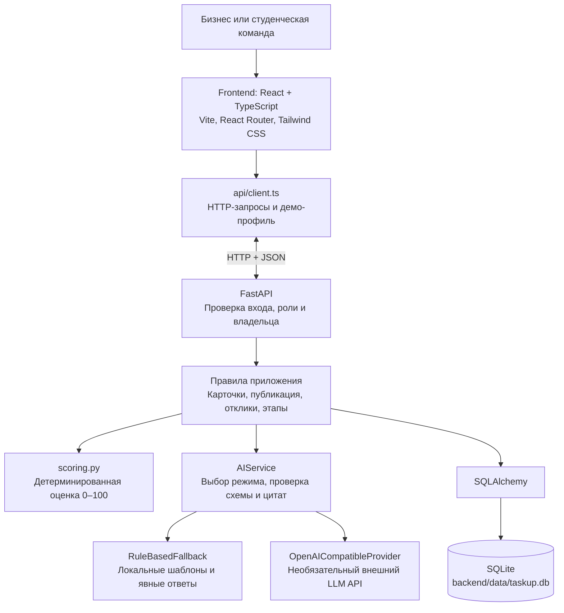
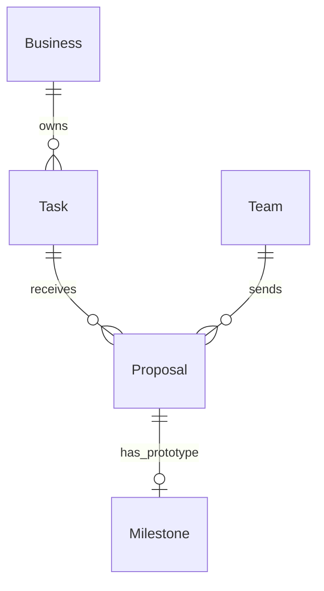

# TaskUp AI: архитектура и объяснение проекта

Этот документ можно передать человеку, который впервые открывает проект. Здесь описана
реализованная версия: назначение приложения, состав кода, движение данных и причины
основных решений. Команды установки находятся в [README](../README.md).

## 1. Какую задачу решает продукт

TaskUp AI связывает бизнес со студенческими командами. Бизнесу помогает сформулировать
понятное задание, а командам — выбрать проект и предложить способ его выполнения.

Основной путь пользователя:

```text
Потребность бизнеса → уточняющие вопросы → редактируемая карточка
→ проверка человеком → рейтинг готовности → публикация
→ предложения команд → ручной выбор → результат → подтверждённые баллы команды
```

В продукте две разные оценки. Рейтинг задачи 0–100 показывает, насколько полно бизнес
описал условия работы. Баллы команды отражают подтверждённое выполнение этапа.
Число откликов и активность команды не увеличивают рейтинг бизнес-задачи.

## 2. Общая архитектура

Приложение состоит из браузерного клиента и одного backend-приложения. Backend устроен
как **модульный монолит**: API, расчёт рейтинга и AI-модуль разделены по файлам, но работают
в одном серверном процессе. Отдельных микросервисов и очередей здесь нет.



При локальной разработке frontend работает на `127.0.0.1:5173`, backend — на
`127.0.0.1:8000`. База — файл, отдельный сервер БД запускать не нужно.
Внешний LLM доступен только backend. Браузер не получает его API-ключ.

## 3. Технологии и их роль

Основной стек был задан в техническом задании. Архитектурные решения подбирались так,
чтобы реализовать обязательный сценарий в пределах небольшого MVP.

| Технология | За что отвечает |
|---|---|
| React | Страницы, формы, компоненты и обновление интерфейса |
| TypeScript | Типы данных клиента: карточки, вопросы, предложения, результаты |
| React Router | Переходы между каталогом, кабинетами и конструктором |
| Vite | Локальный frontend-сервер и production-сборка |
| Tailwind CSS и styles.css | Подключение системы стилей и оформление интерфейса |
| Lucide React | Иконки интерфейса |
| FastAPI | HTTP API, обработка запросов и документация `/docs` |
| Pydantic | Проверка структуры, типов и ограничений входных данных и AI-ответов |
| Pydantic Settings | Чтение серверной конфигурации из окружения и `.env` |
| SQLAlchemy | Модели таблиц, запросы, связи и транзакции |
| SQLite | Постоянное локальное хранение данных |
| HTTPX | HTTP-вызов внешнего AI-провайдера |
| Uvicorn | Процесс, который запускает FastAPI и принимает HTTP-запросы |
| pytest | Проверки серверных правил, API и AI-модуля |
| Playwright | Автоматическая проверка сценариев в браузере |

Зависимости фиксируются в `backend/requirements.txt` и
`frontend/package.json` + `package-lock.json`. `node_modules` и `.venv` — локально
установленные зависимости; они не входят в исходный архив.

## 4. Карта файлов

```text
TaskUp AI/
├── backend/
│   ├── app/
│   │   ├── __init__.py              Python-пакет приложения
│   │   ├── main.py                  FastAPI, запуск, CORS, обработка ошибок
│   │   ├── config.py                Переменные окружения и значения по умолчанию
│   │   ├── database.py              Подключение, сессии, создание таблиц
│   │   ├── models.py                Таблицы и связи SQLAlchemy
│   │   ├── schemas.py               Контракт и валидация Pydantic
│   │   ├── seed.py                  Загрузка демо-данных и явный сброс
│   │   ├── api/
│   │   │   ├── routes.py            HTTP-маршруты и переходы состояний
│   │   │   ├── dependencies.py      Демо-профиль, роли, владение, версии
│   │   │   └── serializers.py       Формирование публичных и приватных ответов
│   │   └── services/
│   │       ├── scoring.py           Формула готовности и подсказки
│   │       └── ai/
│   │           ├── provider.py      Интерфейс AIProvider и HTTP-адаптер
│   │           ├── fallback.py      Локальное извлечение и вопросы
│   │           └── service.py       Выбор режима и проверка evidence
│   ├── prompts/
│   │   ├── analyze_task.txt         Инструкции для анализа описания
│   │   └── compose_card.txt         Инструкции для составления карточки
│   ├── tests/
│   │   ├── conftest.py              Изолированная БД и клиент тестов
│   │   ├── test_scoring.py          Баллы, заглушки, границы уровней
│   │   ├── test_api.py              Права, состояния и полный API-сценарий
│   │   └── test_ai.py               AI-схемы, цитаты, сбои и fallback
│   ├── data/                       SQLite-файлы; .gitkeep хранит пустую папку
│   ├── requirements.txt            Зафиксированные Python-зависимости
│   ├── pytest.ini                  Настройки тестов
│   └── .env.example                Пример серверной конфигурации
├── frontend/
│   ├── src/
│   │   ├── main.tsx                 Вход React-приложения
│   │   ├── App.tsx                  Общая оболочка, профиль, маршруты
│   │   ├── styles.css               Оформление и адаптивность
│   │   ├── api/
│   │   │   ├── client.ts            fetch, заголовки, ошибки, localStorage
│   │   │   └── hooks.ts             Загрузка данных и выполнение действий
│   │   ├── types/index.ts          TypeScript-контракт и подписи полей
│   │   ├── components/common.tsx   Рейтинг, критерии, уведомления и карточки
│   │   └── pages/
│   │       ├── Home.tsx             Выбор роли и демо-профиля
│   │       ├── Catalog.tsx          Общий каталог и фильтры
│   │       ├── Editor.tsx           Пошаговый конструктор задачи
│   │       ├── TaskDetail.tsx       Публичная задача и форма предложения
│   │       └── Dashboards.tsx       Кабинеты, рассмотрение откликов, этапы
│   ├── tests/workflow.spec.ts      Браузерные сценарии
│   ├── playwright.config.ts        Изолированные тестовые серверы и браузер
│   ├── vite.config.ts              Плагины и порт frontend
│   ├── tsconfig.json               Проверка TypeScript
│   ├── index.html                  HTML-оболочка React-приложения
│   ├── package.json                Команды и зависимости
│   ├── package-lock.json           Точные версии дерева npm-зависимостей
│   └── .env.example                Адрес backend для клиента
├── seed/
│   ├── businesses.json             3 вымышленные организации
│   ├── descriptions.json           5 исходных описаний
│   ├── cards.json                  5 структурированных карточек
│   ├── teams.json                  5 студенческих команд
│   ├── proposals.json              5 предложений
│   ├── build_fixtures.py            Воспроизводимое создание JSON-наборов
│   └── README.md                   Пояснения к демо-данным
├── docs/
│   ├── ARCHITECTURE.md              Этот документ
│   ├── AI_EXAMPLE.json              Фактический вход/выход локального режима
│   └── generate_ai_example.py       Генерация этого примера
├── scripts/package_source.py        Сборка архива по списку разрешённых файлов
├── README.md                        Установка, запуск, настройки и ограничения
├── API_CONTRACT.md                  Запросы, ответы, маршруты и ошибки
├── DEMO_SCRIPT.md                   Пятиминутная демонстрация
├── TEAM_PLAN.md                     Работа трёх участников на 300 минут
├── VERIFICATION.md                  Фактически выполненные проверки
└── .gitignore                      Исключения для секретов и локальных файлов
```

`models.py` описывает **хранение в БД**, а `schemas.py` — **допустимые данные на входе
и в AI-результатах**. `serializers.py` определяет, какие поля реально отдаёт API.
TypeScript-типы согласованы с серверной схемой вручную; автоматической генерации типов нет.

## 5. Что находится во frontend

Frontend показывает данные и отправляет действия пользователя на сервер.
Официальные баллы и права на изменение определяет backend.

| Адрес страницы | Что делает |
|---|---|
| `/` | Выбор бизнеса/команды и готового профиля |
| `/catalog` | Общий каталог, фильтры по отрасли и уровню, сортировка |
| `/tasks/:id` | Подтверждённая карточка и отправка предложения |
| `/business` | Задачи текущего бизнеса и число откликов |
| `/business/tasks/new` | Создание новой задачи |
| `/business/tasks/:id/edit` | Редактирование и подтверждение карточки |
| `/business/tasks/:id/proposals` | Сравнение предложений, выбор команд, проверка результата |
| `/team` | Свои предложения, статусы, отправка прототипа и баллы |

`App.tsx` хранит выбранный профиль в React Context. В localStorage сохраняются его
роль, ID и название. Задачи, отклики и баллы хранятся в SQLite, поэтому доступны
при переключении ролей и после перезапуска приложения.

`api/client.ts` добавляет к запросам `X-Demo-Role` и `X-Demo-Actor-Id`, передаёт JSON
и преобразует ошибки в сообщения для интерфейса. `useResource` загружает данные,
`useAction` управляет состояниями действия и блокирует повторную отправку.
В формах текст сохраняется на экране при ошибке API. Это не автоматическое сохранение
несохранённого текста после закрытия вкладки.

## 6. Что делает backend

Серверная обработка действия устроена так:

```text
HTTP-запрос
  → Pydantic проверяет поля, типы, длины и URL
  → dependency определяет демо-профиль и проверяет роль
  → маршрут проверяет владельца и допустимость действия
  → сервис выполняет расчёт или AI-обработку, если она нужна
  → SQLAlchemy сохраняет изменения транзакцией
  → serializer собирает JSON для интерфейса
```

В MVP переходы состояний находятся непосредственно в `api/routes.py`.
Отдельного универсального слоя репозиториев или сервисов для каждой таблицы нет.
Самостоятельно выделены повторно используемый расчёт рейтинга и AI-интеграция.

Группы API:

| Группа | Маршруты и действия |
|---|---|
| Проверка сервера | `GET /api/health` |
| Профили | `GET /api/demo/profiles` |
| Задачи бизнеса | `GET/POST /api/business/tasks`, `GET /api/business/tasks/{id}` |
| Черновик | `PATCH /api/business/tasks/{id}/draft` |
| Помощник | `POST .../{id}/analyze`, `POST .../{id}/compose` |
| Рейтинг и публикация | `POST .../{id}/score-preview`, `confirm`, `publish` |
| Общий каталог | `GET /api/tasks`, `GET /api/tasks/{id}` |
| Предложения | `POST /api/tasks/{id}/proposals`, `GET /api/business/tasks/{id}/proposals` |
| Решение бизнеса | `PATCH /api/proposals/{id}/status` |
| Кабинет команды | `GET /api/team/proposals` |
| Результат | `POST /api/proposals/{id}/milestones`, `POST /api/milestones/{id}/confirm` |

Ошибки имеют общий вид: `{ "error": { "code": "…", "message": "…", "details": {} } }`.
Например, чужое действие даёт 403, отсутствующий ресурс — 404, устаревшая версия — 409,
неправильные поля — 422. Внутренние исключения и ключи провайдера в ответы не включаются.

## 7. База данных: пять сущностей



**Business** — организация: `id`, `name`, `demo_contact`.
Один бизнес владеет несколькими задачами.

**Task** — центральная запись. Хранит владельца, отрасль, исходное описание,
вопросы, ответы, рабочую и подтверждённую карточки, состояние публикации, рейтинг,
расшифровку и даты. Дополнительно содержит `version`, подтверждённую отрасль
`confirmed_industry`, сведения о режиме AI и `evidence` — цитаты-источники.

**Team** — профиль команды: название, интересы, навыки и технологии.

**Proposal** — предложение конкретной команды по конкретной задаче: идея,
план, срок, необязательная ссылка и статус `pending`, `accepted` или `rejected`.
Связка `task_id + team_id` уникальна: одна команда не отправляет дубликаты на одну задачу.
Число разных команд не ограничено. У задачи нет поля «единственная выбранная команда».

**Milestone** — отправленный результат по принятому предложению: описание,
ссылка, статус `submitted`/`confirmed`, баллы и даты. В текущем MVP допустим только
`stage_code = prototype`, а пара `proposal_id + stage_code` уникальна. Это даёт
не более одного демонстрационного этапа на предложение.

Сложные вложенные структуры карточки, вопросов и ответов хранятся в JSON-колонках.
Владение и связи между организациями, задачами, командами и предложениями заданы
внешними ключами. В SQLite включена проверка внешних ключей.

## 8. Почему у задачи три отдельных состояния

У задачи есть три независимых понятия:

| Поле | Значение |
|---|---|
| `draft_card` | Рабочая карточка, которую можно менять вручную или через помощника |
| `confirmed_card` | Последний снимок, который явно подтвердил человек |
| `is_published` | Разрешён ли показ подтверждённого снимка в общем каталоге |

Пример: задача опубликована с рейтингом 100. Владелец удаляет сведения о данных
в редакторе. Предварительная оценка становится 90, но команды пока видят
прежнюю карточку с 100. После «Подтвердить сведения» публичный снимок и официальный
рейтинг обновляются вместе. До этого сохранение черновика не меняет каталог.

Первичная публикация требует подтверждённой текущей карточки и названия.
Заполнение всех полей и минимальный рейтинг не требуются. «Черновик» как уровень
готовности 0–39 не означает запрет публикации.

Чтобы две вкладки не перезаписали работу друг друга, клиент передаёт `version`.
Если серверная версия уже изменилась, запрос отклоняется. SQLAlchemy дополнительно
проверяет версию при записи в БД. Полной истории всех редакций в MVP нет.

## 9. Как работают рейтинг и баллы команды

Функция `calculate_score` в `services/scoring.py` выполняет обычный детерминированный
расчёт. Одинаковая карточка даёт одинаковый результат без обращения к AI.

| Сведения | Максимум |
|---|---:|
| Контекст + потребность | 10 + 10 |
| Данные + источник данных | 10 + 10 |
| Ожидаемый результат | 15 |
| Полный критерий успеха с ожидаемым значением и способом проверки | 15 |
| Срок + ограничения | 5 + 5 |
| Пользователи | 10 |
| Контакт | 5 |
| Формат взаимодействия вместе с процессом обратной связи | 5 |
| **Всего** | **100** |

Для парного подпункта взаимодействия нужны оба поля. Для критериев достаточно хотя
бы одного полного объекта. Пустые строки и заглушки не дают баллов. Ответ «данных нет»
не подтверждает наличие материалов. Название необходимо для публикации, но баллов не даёт.

Результат функции содержит `total_score`, `readiness_level`, `breakdown`,
`improvement_suggestions`, `next_level`, `points_to_next_level`. Одна и та же функция
используется для предварительного просмотра, подтверждения и seed-данных.

Уровни: **0–39 — Черновик; 40–69 — Рабочая; 70–89 — Готовая; 90–100 — Приоритетная.**
Каталог по умолчанию показывает больший рейтинг первым. При равенстве сначала идёт
более ранняя публикация, затем меньший ID.

Баллы команды устроены отдельно: после подтверждения прототипа запись этапа получает
ровно 10 баллов. Сервер устанавливает значение, а не прибавляет 10 при каждом запросе.
Общий результат команды вычисляется суммой подтверждённых этапов. Повторный запрос
не удваивает баллы. Отправка отклика и принятие команды дают 0.

## 10. AI-модуль и его границы

AI отвечает за две операции:

1. `analyze_draft` — найти известные сведения, определить пробелы и задать 3–5 вопросов.
2. `compose_card` — собрать карточку из исходного описания и реальных ответов человека.

При анализе сервер сохраняет вопросы и сведения о режиме; найденные поля возвращаются
в результате анализа. При составлении записываются `draft_card` и цитаты `evidence`.
Ни одна из этих операций сама не подтверждает и не публикует задачу.

**`provider.py`** задаёт интерфейс `AIProvider` и внешний HTTP-адаптер.
Провайдер, адрес, ключ, модель и timeout настраиваются через `.env`.

**`fallback.py`** содержит `RuleBasedFallback`. Он выбирает вопросы из шаблонов,
копирует ответы в связанные поля, распознаёт явные метки и некоторые простые фразы.
Произвольный текст он не понимает как полноценная языковая модель. Если сведения
не распознаны, человек может заполнить их в редакторе.

**`service.py`** выбирает реализацию и обрабатывает сбои. Нет ключа или модели,
провайдер недоступен, произошёл timeout или ответ не соответствует схеме — используется
локальный режим с явной пометкой в интерфейсе.

Для переносимого факта требуется `evidence`: ID исходного описания/ответа и точная
цитата. Сервер проверяет наличие цитаты в указанном источнике; поля без опоры удаляются.
Проверка не доказывает, что цитата правильно интерпретирована. Поэтому бизнес всё равно
должен проверить карточку. Оценка готовности также не является проверкой правдивости сведений.

В проекте реализован настоящий HTTP-адаптер, однако живой вызов внешнего LLM при
первоначальной разработке не выполнялся: ключ не предоставлялся. Для тестов использовались
mock-ответы провайдера. Локальный сценарий проверен полностью.

## 11. Пример движения данных от начала до конца

1. Бизнес вводит описание. `Editor.tsx` отправляет `POST /api/business/tasks`.
   Backend создаёт `Task` с пустой рабочей карточкой и возвращает ID и версию.
2. Клиент вызывает `analyze`. Помощник возвращает вопросы с ID вроде `q_users`.
3. Ответы сохраняются через `PATCH draft`. ID вопроса должен соответствовать полю,
   поэтому ответ про пользователей не попадёт в контакт или срок.
4. `compose` формирует рабочую карточку. Неизвестные строки остаются `null`, список
   неизвестных критериев — `[]`. Человек редактирует результат.
5. `score-preview` показывает возможную оценку, ничего не записывая в БД.
6. `confirm` проверяет владельца и версию, создаёт подтверждённый снимок,
   пересчитывает оценку и сохраняет всё одной транзакцией.
7. `publish` открывает карточку для каталога. `GET /api/tasks` возвращает публичный
   снимок; исходные ответы и рабочий черновик в него не входят.
8. Команда отправляет предложение. Сервер создаёт `Proposal` со статусом `pending`.
9. Бизнес меняет статус на `accepted` или `rejected`. Другие предложения не меняются.
10. Принятая команда отправляет `Milestone`. До проверки его баллы равны 0.
11. Бизнес подтверждает результат. Этап получает 10 баллов, кабинет команды показывает
    обновлённую сумму. Готовность бизнес-задачи остаётся прежней.

## 12. Логика проектирования и компромиссы

**Начать с полного пользовательского пути.** Для этого MVP ценность заключается
в работающем переходе от описания к подтверждённому результату. Поэтому первыми были
зафиксированы контракт карточки, API и переходы состояний, затем реализован серверный
путь с БД и локальным помощником, после чего подключён интерфейс и проверки.

**Сохранить единый источник данных на сервере.** SQLite хранит общие задачи и отклики.
Это позволяет показывать одно состояние бизнеса и команды и сохранять работу между
перезапусками. Браузер хранит только выбор демо-профиля.

**Разделить помощь AI и решения человека.** Генерация подготавливает сведения.
Подтверждение, публикация, выбор исполнителей и приёмка результата требуют отдельного
действия. Ошибка модели поэтому не должна сама изменить публичную задачу или начислить баллы.

**Сделать рейтинг объяснимым.** Фиксированная функция и одинаковая рубрика дают
воспроизводимый результат и конкретные подсказки. Длина красивого текста сама по себе
не повышает оценку. При этом рубрика измеряет заполненность, а не бизнес-ценность проекта.

**Обеспечить демонстрацию без ключа и сети.** Локальная реализация позволяет пройти
обязательный сценарий даже при недоступности внешнего API. Пользователь видит, какой
режим работает. Ограничения локального анализа описаны явно.

**Поддержать несколько команд через отдельные предложения.** Решение принадлежит
каждой записи `Proposal`. Модель данных естественно допускает несколько принятых команд
и независимые результаты по каждой из них.

**Ограничить инфраструктуру задачей хакатона.** Один backend, SQLite и простые JSON-поля
сокращают настройку и позволяют разделить работу между тремя участниками. В MVP нет
очередей фоновых AI-заданий, регистрации, чата, хранения файлов и системы миграций БД.
Эти возможности не заявлены как уже реализованные.

## 13. Проверки и эксплуатационные ограничения

При первоначальной сдаче прошли **48 backend-тестов**, **2 браузерных теста**,
проверка TypeScript, production-сборка и `pip check`. Эти результаты относятся к
проверенной версии, а не к новому запуску тестов при написании этого документа.
Подробности находятся в [VERIFICATION.md](../VERIFICATION.md).

Backend-тесты покрывают формулу, границы уровней, неизвестные поля, права, версии,
публикацию, несколько команд, AI-ошибки и отсутствие повторного начисления.
Браузерный сценарий проходит путь с ростом готовности **20 → 100** и начислением
**10 баллов команде**, а также проверяет фильтры и сохранение формы после ошибки.

Роли передаются демо-заголовками, которые можно подменить. Проверки владельца работают
в рамках выбранного профиля, но безопасной аутентификации с доказательством личности нет.
Приложение рассчитано на локальную демонстрацию с синтетическими данными.
Отключение `DEMO_MODE` блокирует приватные демо-действия, но не включает другую систему входа.

Рабочая БД, `.env`, `node_modules`, `.venv` и результаты тестов исключены из исходного
архива. Seed запускается отдельно и не дублирует записи. Сброс всех демо-данных требует
явной команды `python -m app.seed --reset --yes`.

## 14. С чего другу начать изучение

1. Запустить проект по [README](../README.md) и пройти [демо](../DEMO_SCRIPT.md).
2. Прочитать [API_CONTRACT](../API_CONTRACT.md): какие данные обменивают части приложения.
3. Открыть `schemas.py` и `models.py`: формат карточки и хранение сущностей.
4. Посмотреть `routes.py`, особенно `confirm`, `publish` и `confirm_milestone`.
5. Разобрать `scoring.py`, затем папку `services/ai`.
6. На frontend проследить путь `Editor.tsx` → `api/client.ts` → серверный маршрут.
7. Прочитать `test_end_to_end` в `test_api.py`: исполняемый пример всей бизнес-логики.

Для совместной разработки Даурену выделены backend и БД, Алишеру — frontend,
третьему участнику — AI, seed, интеграционные тесты и демонстрация. Общие изменения
схемы согласуются между `schemas.py`, `types/index.ts` и `API_CONTRACT.md`.
